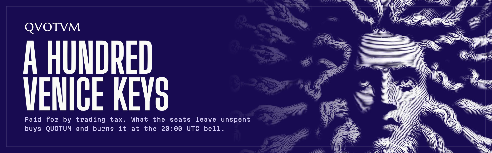
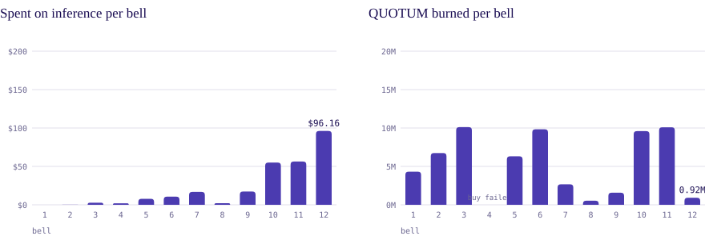

  
  
  
  

# quotum

A hundred Venice API keys, paid for by the trading tax of the QUOTUM token on Robinhood Chain. Each seat's key has a daily dollar cap, and what the seats leave unspent at the 20:00 UTC bell buys QUOTUM and burns it. Every bell is a public transaction.

## Every bell

<picture>
  <source media="(prefers-color-scheme: dark)" srcset="bells-dark.svg">
  
</picture>

Closed bells from [quotum.org/api/usage.json](https://quotum.org/api/usage.json), redrawn after each bell. Seat 1 is the team's seat; every other seat is a holder seat. Bell 4's buy failed, so nothing burned that day. Each bell's transaction is on [quotum.org/usage](https://quotum.org/usage).

## Use a seat

- [hermes-quotum](https://github.com/qvotvm/hermes-quotum): run a seat's key as a model provider in Hermes Agent, with the seat's cap, spend and the time to the bell in `/usage`.
- [t.me/qvotvm](https://t.me/qvotvm): Centimanus, an agent on seat 1, posts Robinhood Chain findings with their sources and what each run cost.

Site [quotum.org](https://quotum.org), docs at [quotum.org/docs](https://quotum.org/docs), news on X at [@quotumorg](https://x.com/quotumorg).
